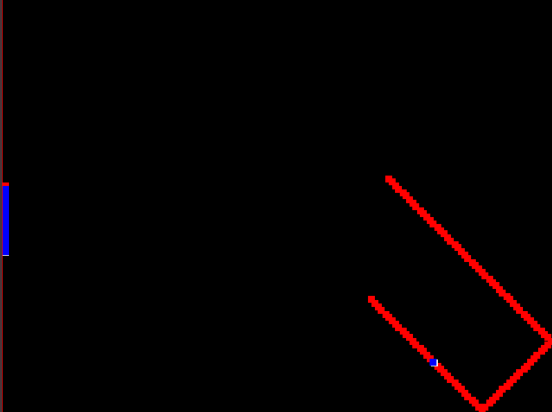

BioPong: Biologically Iinspired Machine Learning

BioPong is a machine learning research project inspired by recent studies where biological brain organoids played Pong from inside a laboratory petri dish. What was most interesting about the biological experiment was the observation that the neurons' behavior could be controlled by their desire to maximize expectation and minimize surprise.
The cells could be motivated to make the paddle hit the ball by introducing random input signals, which are impossible to predict, for a brief duration whenever the paddle missed the ball.  [Read more about the inspiration for this project.](https://neurosciencenews.com/organoid-pong-21625/)

This biological learning approach is actually very different from traditional methods used in deep reinforcement learning, which, for the most part, rely on the Bellman Equation and policy fitting with known rewards. 
The BioPong research project aimed to determine whether computer neural networks could learn to play pong under the same conditions as biological cells, without any direct rewards and using only random signals as a negative feedback indicator.

BioPong represents the pong enviroment by three normalized values between -0.5 and 0.5 for the paddle y position, ball x position, and ball y position. The three values are sequentially streamed to the model and the model can select either of 3 actions, move up, move down, or don't move for each state observation. If the paddle misses hitting the ball, meaning the ball moves beyond the left boarder then the enviroment streams random values for each of the three position values for a set duration of steps and the environment resets.

The model utilized by BioPong is an action-conditioned, model predictive architecture, specifically the Recurrent State Space Model (RSSM) from the [DreamerV2 project](https://github.com/danijar/dreamerv2/tree/main). The RSSM can be used to imagine potential future states resulting from executing a sequence of actions. As it experiences a variety of state/action sequences in the environment, the RSSM's predictions become more accurate. An ensemble prediction pair produces two different forecasts, and the model measures uncertainty by the distance between these predictions. For previously unseen state/action sequences, it's unlikely that the ensemble will generate identical predictions, given their distinct weight values. However, with sufficient exposure to the same sequences, both models in the ensemble converge to the correct prediction and reach agreement. The RSSM is nondeterministic and captures stochasticity in its predictions, allowing it to imagine the random sequences that occur when the paddle misses the ball. Each model in the ensemble pair generates unique random predictions, resulting in a high distance between them, as they originate from independent random distributions. With an accurate prediction model, the cost of uncertainty in a sequence of actions can be assessed to determine if the paddle hits the ball. This uncertainty, defined as the distance between the ensemble pair's predictions, exhibits high values during misses and low values during familiar observations. Due to its network batch parallelism, the RSSM can process multiple action sequences simultaneously. A strategic selection of action sequences, based on a set future horizon length, is fed into the RSSM. The action sequence with the lowest uncertainty is then chosen by the model.

Environment and Setup:

train.py - Run the main training loop which either loads a previous saved rssm network or inializes a new one. The PlannerNet can be called in either two modes, with mode = 1 cacluating the difference as a measure of uncertainty and actions are selected which most minimize the uncertainty. There is also mode = 0 which is used for testing and comparision with a cost being calcualated as the distance between the paddle and ball y values, and actions are selected which most minimze this cost. Paramaters such as batch_size, time_steps, sequence_length, time_actions, train_rallies, and wether or not to train, save, and how many train_steps per rally can also be configured.

  batch_size - how many parrallel squences to train at a time
  time_steps - the length of the training sequence
  sequence_length - the look ahead time steps used to plan actions. This should be long enough to catch the ball before it misses, but longer horizons take more time.
  time_actions - how many previous steps to use when doing predictions and perception in the rssm
  train_rallies - how many rallies to train for, where each rally is counted by when the ball bounces off the right side wall.
  train_steps - how many serial train steps to run at the end of each rally

rssm_common - Contains all the tensorflow code to run and use the rssm network. [Code from DreamerV2.](https://github.com/danijar/dreamerv2/tree/main)

container.py - Contains the code to run the BioPong environment with pygame

utils.py - Helper functions for train.py
